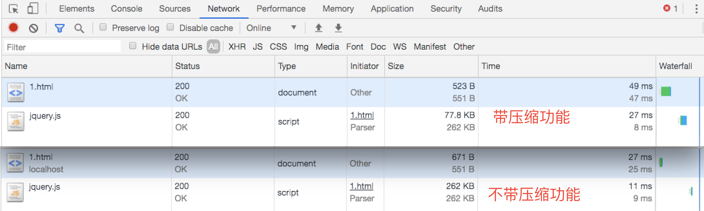
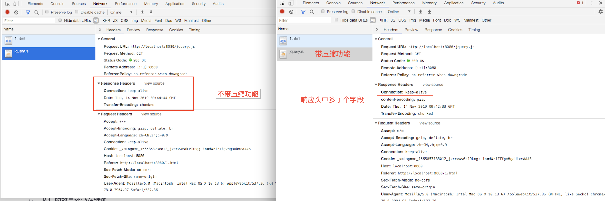
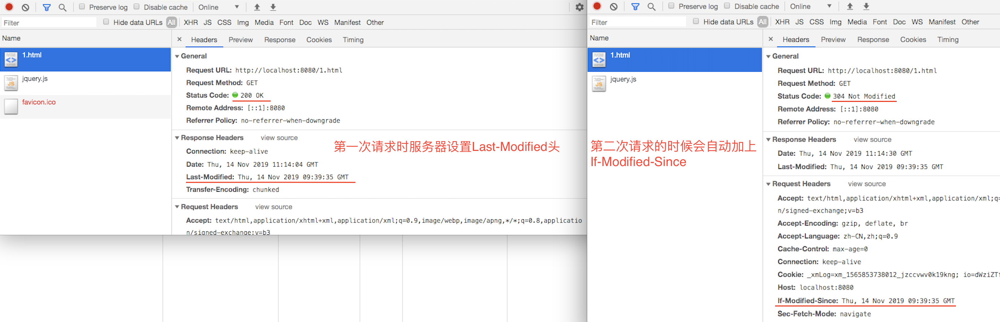

### Node 静态资源服务器
> 静态资源服务器是一种从服务器功能来分类的，顾名思义就是仅仅处理浏览器的静态资源请求  
> 这里的静态资源是指 html、js、css、图片、音视频。。。等文件

#### 创建服务器
&emsp;&emsp;通过原生的 http 模块，启动一个服务，处理文件请求。

```javascript
const http = require('http')
const fs = require('fs')
const url = require('url')

const server = http.createServer((req, res) => {
  const { pathname } = url.parse(req.url, true)
  fs.readFile(`static${pathname}`, (err, data) => { // 假设静态资源存放在 static 的目录下
    if (err) {
      res.writeHeader(404)
      res.write('Not Found')
    } else {
      res.write(data)
    }
    res.end()
  })
})

server.listen(8080)
```
&emsp;&emsp;其实通过 fs.readFile 的方式读取文件再发送给浏览器其实是一个非常耗时的过程，因为当文件很大的时候，只有当文件全部读到内存后才会开始发送给浏览器。

&emsp;&emsp;这样浏览器的这个请求就有很大一部分时间浪费在了等待服务器读取文件，这样就限制服务器处理能力，无法应对高并发以及大文件的请求。  

&emsp;&emsp;因此服务器就需要以流的形式处理读取文件和发送文件，简单的说就是 **读一点文件，就发送一点**，这是需要用到 **stream**。


#### 流形式的静态资源服务器
&emsp;&emsp;通过原生 fs 模块提供的 **createStream** 方法，使用流的形式处理静态资源的读取与发送，以提高服务器的性能。  

```javascript
const http = require('http')
const fs = require('fs')
const url = require('url')

const server = http.createServer((req, res) => {
  const { pathname } = url.parse(req.url, true)
  const stream = fs.createReadStream(`static${pathname}`)
  stream.pipe(res)

  stream.on('error', error => {
    res.writeHeader(404)
    res.write('Not Found')
    res.end()
  })
})

server.listen(8080)
```
&emsp;&emsp;但是这种方式有个很大的问题，那就是传输的文件没有被压缩，这样线上的服务器会浪费很大的带宽，那就是在浪费成本。

#### 压缩形式的静态资源服务器
&emsp;&emsp;通过原生的 zlib 模块，将读取的流文件压缩后在发送给浏览器。

```javascript
const http = require('http')
const fs = require('fs')
const url = require('url')
const zlib = require('zlib')

const server = http.createServer((req, res) => {
  const gzip = zlib.createGzip()
  const { pathname } = url.parse(req.url, true)
  const stream = fs.createReadStream(`static${pathname}`)

  res.setHeader('content-encoding', 'gzip')
  stream.pipe(gzip).pipe(res)

  stream.on('error', error => {
    res.writeHeader(404)
    res.write('Not Found')
    res.end()
  })
})

server.listen(8080)
```
&emsp;&emsp;因此可以查看下面两张图片的对比，更加明确前后的差距  

##### 文件大小比较  


##### 响应头比较


&emsp;&emsp;可以粗略的计算下，压缩前后的节约的多少的空间：  

    (262 - 77.8)/262 = 0.703
    因此，可以看出压缩的这个功能购节约大约 70% 的贷款成本，真的是没想到 ！！！


#### 带缓存策略的静态资源服务器
&emsp;&emsp;上面的静态资源服务器能够很好的解决首次拿到资源以及资源发生更新时的情况，但是当静态资源文件没有发生变化时，这个时候其实可以直接使用缓存文件，能够让用户有更快的体验，以及减小服务器的压力。  

##### 服务器缓存策略
&emsp;&emsp;为了解决上述的未更新的静态资源重新获取的问题，可以通过设置不同的缓存策略来解决，通常有 **强缓存** 和 **协商缓存**。  

    那么协商缓存是什么？
      1、第一次请求资源时，服务器会在响应头(大小写不敏感)中加上 Last-Modified 字段，表示资源最后一次更新的时间；
      2、以后浏览器再次请求该资源时，会在请求头中自动设置 If-Modified-Since 字段，值为上次服务器返回的 Last-Modified 的值；
      3、当服务器在请求头中拿到了  If-Modified-Since ，就会判断该资源的最后更新时间是否相同：
          如果相同，则返回 304 浏览器直接使用缓存；
          如果不相同，则会从新设置 Last-Modified 的值；

这里以 **协商缓存** 为例，看一下 node 服务器是实现缓存策略的。  

```javascript
const http = require('http')
const fs = require('fs')
const url = require('url')
const zlib = require('zlib')

const server = http.createServer((req, res) => {
  const { pathname } = url.parse(req.url, true)
  console.log(pathname)

  fs.stat(`static${pathname}`, (err, stat) => { // fs.stat 能够获取到文件的基本信息
    if (err) {
      send404(res)
    } else {
      const time = stat.mtime.toUTCString()
      const if_modified_since = req.headers['if-modified-since'] // headers 中的头必须为小写

      if (if_modified_since) { // 比较下最后更新时间
        const client_time = Math.floor(new Date(if_modified_since).getTime()/1000)
        const server_time = Math.floor(new Date(time).getTime()/1000)
        if (server_time <= client_time) {
          send304(res)
        } else {
          sendData(pathname, time, res)
        }
      } else {
        sendData(pathname, time, res)
      }
    }
  })
})

server.listen(8080)

const send404 = (res) => {
  res.writeHeader(404)
  res.write('Not Found')
  res.end()
}

const send304 = (res) => {
  res.writeHeader(304)
  res.write('Not Modified')
  res.end()
}

const sendData = (pathname, time, res) => {
  const stream = fs.createReadStream(`static${pathname}`)
  res.on('error', error => {
    send404(response)
  })

  res.setHeader('Last-Modified', time)
  stream.pipe(res)
}
```
##### 带有缓存策略的前后请求头



#### 多进程处理请求的静态资源服务器
&emsp;&emsp;当纯手工搭建的服务器经过这一系列的优化之后，已经拥有了不错的性能了，但是还有个问题，那就是这个服务不够健壮，比如遇见未知错误时，会直接挂掉导致整个服务不可用。对于一台线上的服务器，这样肯定是不行的，那又该如何解决呢？   
&emsp;&emsp;答案就是 **使用多进程的方式处理请求**。  
&emsp;&emsp;NodeJS 的 cluster 模块 **可以创建共享服务器端口的子进程**。我们都知道 NodeJS 实例是运行在单个线程中，我们可以充分的利用多核系统，去启用一组 NodeJS 进程去处理负载任务。  

```javascript
const http = require('http')
const os = require('os')
const cluster = require('cluster')

if (cluster.isMaster) {
  const cpu_counts = os.cpus().length
  for(let i=0; i<cpu_counts; i++) {
    cluster.fork() // 父进程 创建 子进程
  }
} else { // 子进程专门用来处理请求
  const server = http.createServer((req, res) => {
    // 处理请求。。。
  })
  server.listen(8080) // 父子进程间，可以监听相同的端口
}
```

&emsp;&emsp;综上，我们就可以自己手动搭建出一个，节约带宽和流量的前提下，性能还算可以的，也不容易宕机的 **Web Node 静态资源服务器**。


<p align="right"> 2019年11月14日 </p>