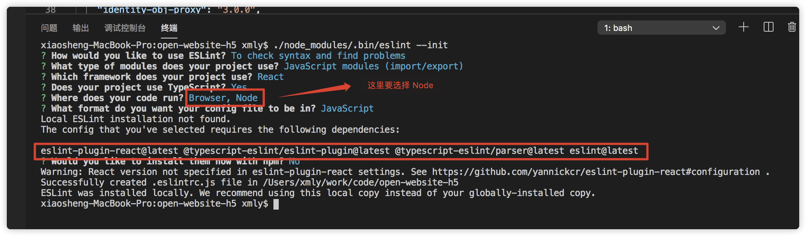

### 在 create-react-app 中使用 ESLint
通常我们会使用 create-react-app 来创建单页面应用，而且启用 ESLint 来限制编码格式

有关 ESLint 的基本信息[请参照](/full_stack/eslint/)

!> create-react-app 默认是支持 ESLint的，但是只是未开启而已

### 初始化 ESLint
使用 `./node_modules/.bin/eslint --init` 创建 .eslintrc.js 配置文件


!> 注意：  
  如果你的项目是 yarn 来管理包，则最后一项是否使用 npm 安装这些包需要选择 No  
  需要安装图中圈出的这些包，但是 create-react-app 都已经给我们装好，无需二次安装  

此时会得到这样的一个 .eslintrc.js 的配置文件
```javascript
  module.exports = {
    "env": {
      "browser": true,
      "es6": true,
      "node": true
    },
    "extends": [
      "eslint:recommended",
      "plugin:react/recommended",
      "plugin:@typescript-eslint/eslint-recommended"
    ],
    "globals": {
      "Atomics": "readonly",
      "SharedArrayBuffer": "readonly"
    },
    "parser": "@typescript-eslint/parser",
    "parserOptions": {
      "ecmaFeatures": {
        "jsx": true
      },
      "ecmaVersion": 2018,
      "sourceType": "module"
    },
    "plugins": [
      "react",
      "@typescript-eslint"
    ],
    "rules": {
    }
  };
```

### 选择代码风格
选择 Airbnb 或 standard  

#### 安装
以 airbnb 为例  
```yarn
  // 安装 airbnb 相关的包
  yarn add eslint-config-airbnb -D
```

以 standard 为例
```yarn
  // 安装 standard 相关的包
  yarn add eslint-config-standard eslint-config-standard-react eslint-plugin-standard eslint-plugin-node  eslint-plugin-promise 
```

#### 配置 extends
删除 package.json 中的 "eslintConfig" 选项，然后设置 .eslintrc.js 中的 extends 选项如下
```javascript
  // airbnb
  "extends": [
    "airbnb",
    "react-app",
    "eslint:recommended",
    "plugin:react/recommended",
    "plugin:@typescript-eslint/eslint-recommended"
  ],

  // standard
  "extends": [
    "eslint:recommended",
    "plugin:react/recommended",
    "plugin:@typescript-eslint/eslint-recommended",
    "standard", 
    "standard-react",
    "react-app"
  ],
```

#### 自定义 rules
并且还可以在 rules 自定义一些规则
```javascript
  "rules": {
    "react/jsx-filename-extension": [1, { extensions: [".js", ".tsx"] }], // 允许js文件使用jsx语法
    "react/prop-types": 1, // 开启PropTypes验证
    "react/forbid-prop-types": 0,
    "linebreak-style": 0,
    "react/jsx-one-expression-per-line": 0,
    "react-hooks/rules-of-hooks": "error", // 检查 Hook 的规则
    "react-hooks/exhaustive-deps": "warn", // 检查 effect 的依赖
    'import/no-unresolved': [1, { ignore: ['^@/'] }],
  },
```

!> 注意：如果发现修改 .eslintrc.js 的配置不生效，原因是 create-react-app 提供了一套常见的规则，在webpack.config.js 里面有个 eslint-loader 的配置，cache 属性设置的是 true，把它修改为 false，重启后修改的eslintrc就可以生效了

#### 忽略文件
1. 在文件的头部添加 `/* eslint-disable */`
2. 对指定行禁用规则警告，
  * eslint-disable-line，对当前行禁用规则警告
  * eslint-disable-next-line，对下一行禁用规则警告
3. 在 package.json 中，新增如下配置
```javascript
  "eslintIgnore": [
    "/config/", "/scripts/", "/build/", "/public/"
  ]
```

至此，react-react-app 即会使用 standard style 的代码风格来检查项目中的业务代码。

#### 搭配使用
通常 ESLint 不会单独使用，而是
1. [配合 prettier 实现代码自动格式化](/full_stack/eslint/prettier)  
2. 配合 husky 实现处理 pre-commit、 pre-push 等 githooks 的工具
3. 配合 lint-staged 实现 对 git 暂存区的代码，运行 linters 的工具
