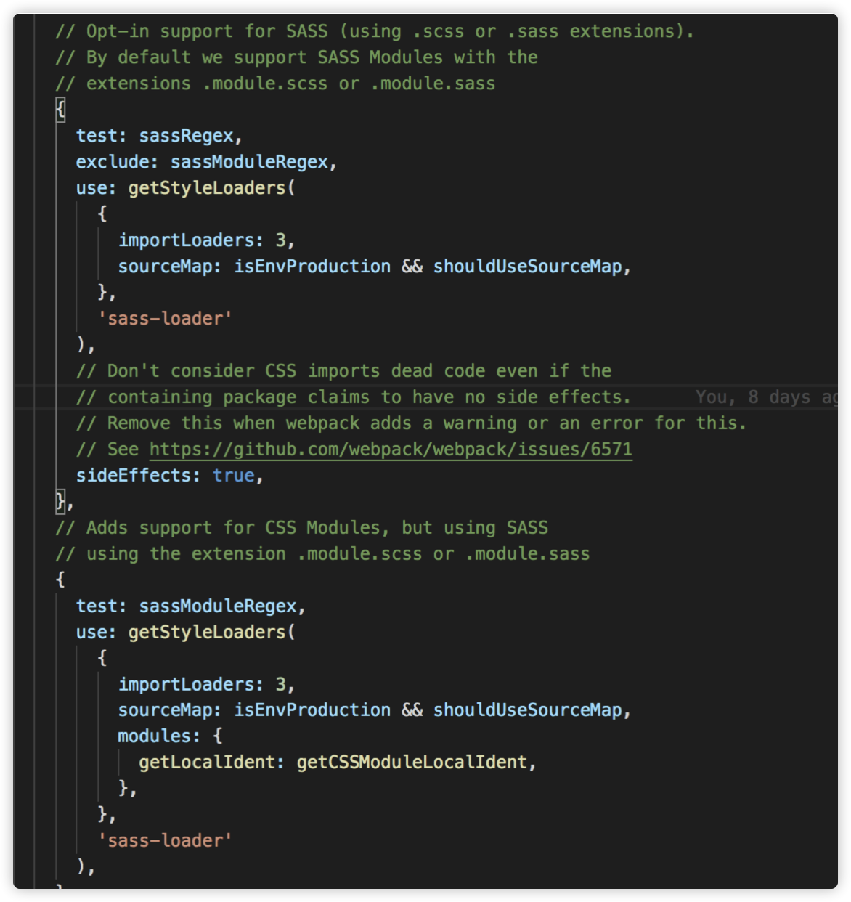
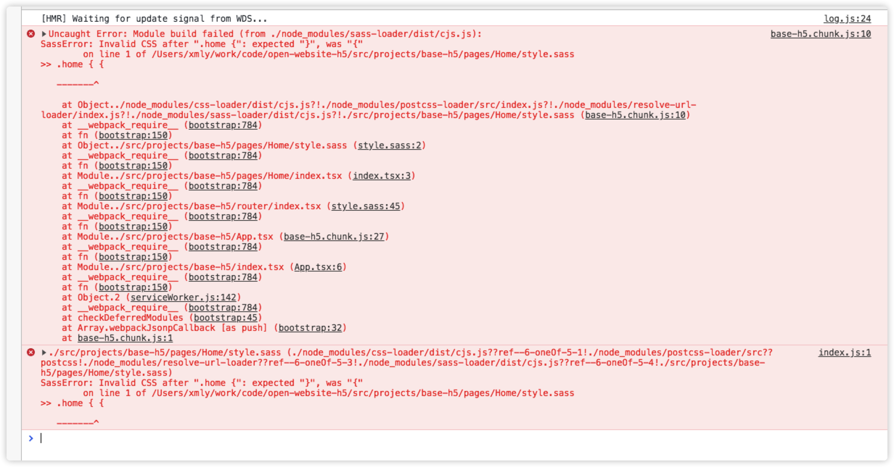

### 在 create-react-app 中开启 sass
create-react-app 在 reject 之后，打开 webpack 配置文件可以看见，默认支持解析 sass 样式文件，但是需要先安装 node-sass
```
  yarn add node-sass -D
```


但是在项目中，新建 sass 文件，并且在 tsx 文件中 import，写上 css 样式，页面就会报错，如下图  

!> 注意，当不写 css 样式时，却不会报错



原因是：**sass有两种后缀名文件：**
* 一种后缀名为sass，不使用大括号和分号  
* 另一种就是scss文件，这种和我们平时写的css文件格式差不多，使用大括号和分号  

而上面报错的原因就是因为我们新建的是 sass 文件，而将 sass 文件的后缀改成 scss 即可解决。

!> sass/scss 模块化其实也是开启的，只用注意文件的命名即可，即 文件名中符合 ***.module.scss** 即可