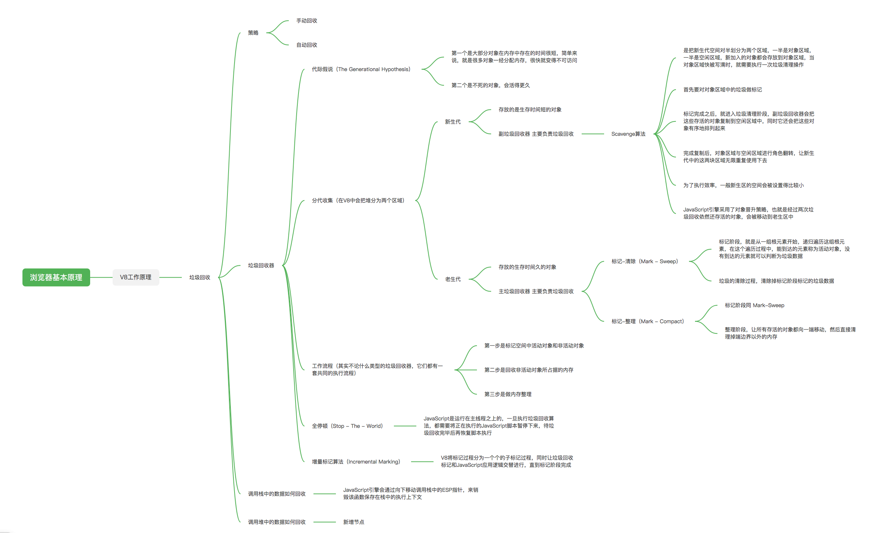

### 垃圾回收：垃圾数据是如何自动回收的？

#### 不同语言的垃圾回收策略
通常情况下，垃圾数据回收分为**手动回收**和**自动回收**两种策略  

JavaScript、Java、Python 等语言，产生的垃圾数据是由垃圾回收器来释放的，并不需要手动通过代码来释放

#### 调用栈中的数据是如何回收的
当一个函数执行结束之后，JavaScript 引擎会通过向下移动 ESP 来销毁该函数保存在栈中的执行上下文

#### 堆中的数据是如何回收的
要回收堆中的垃圾数据，就需要用到 JavaScript 中的垃圾回收器了  

### 代际假说和分代收集
代际假说（The Generational Hypothesis）
* 第一个是大部分对象在内存中存在的时间很短，简单来说，就是很多对象一经分配内存，很快就变得不可访问；
* 第二个是不死的对象，会活得更久；

通常，垃圾回收算法有很多种，但是并没有哪一种能胜任所有的场景，你需要权衡各种场景，根据对象的生存周期的不同而使用不同的算法，以便达到最好的效果

在 V8 中会把堆分为新生代和老生代两个区域，新生代中存放的是生存时间短的对象，老生代中存放的生存时间久的对象  
* 新生区通常只支持 1～8M 的容量，**副垃圾回收器**，主要负责新生代的垃圾回收
* 老生区支持的容量很大，**主垃圾回收器**，主要负责老生代的垃圾回收

#### 垃圾回收器的工作流程
> 其实不论什么类型的垃圾回收器，它们都有一套共同的执行流程

1. 第一步是标记空间中活动对象和非活动对象
    * 所谓活动对象就是还在使用的对象
    * 非活动对象就是可以进行垃圾回收的对象
2. 第二步是回收非活动对象所占据的内存
    * 其实就是在所有的标记完成之后，统一清理内存中所有被标记为可回收的对象
3. 第三步是做内存整理
    * 一般来说，频繁回收对象后，内存中就会存在大量不连续空间，我们把这些不连续的内存空间称为内存碎片
    * 当内存中出现了大量的内存碎片之后，如果需要分配较大连续内存的时候，就有可能出现内存不足的情况

#### 副垃圾回收器
* 通常情况下，大多数小的对象都会被分配到新生区，所以说这个区域虽然不大，但是垃圾回收还是比较频繁的
* 新生代中用 Scavenge 算法来处理
  * Scavenge 算法，是把新生代空间对半划分为两个区域，一半是对象区域，一半是空闲区域
    1. 把新生代空间对半划分为两个区域，一半是对象区域，一半是空闲区域
    2. 新加入的对象都会存放到对象区域，当对象区域快被写满时，就需要执行一次垃圾清理操作
    3. 先对对象区域中的垃圾做标记，标记完成之后，把这些存活的对象复制到空闲区域中
    4. 完成复制后，对象区域与空闲区域进行角色翻转，也就是原来的对象区域变成空闲区域，原来的空闲区域变成了对象区域
  * 对象晋升策略：
    * 经过两次垃圾回收依然还存活的对象，会被移动到老生区中

#### 老生代
* 算法：标记 - 清除（Mark-Sweep）算法
  * 原理：
    1. 标记：标记阶段就是从一组根元素开始，递归遍历这组根元素，在这个遍历过程中，能到达的元素称为活动对象，没有到达的元素就可以判断为垃圾数据。
    2. 清除：将垃圾数据进行清除。
  * 碎片：
    * 对一块内存多次执行标记 - 清除算法后，会产生大量不连续的内存碎片。而碎片过多会导致大对象无法分配到足够的连续内存。

* 算法：标记 - 整理（Mark-Compact）算法
  * 原理：
    1. 标记：和标记 - 清除的标记过程一样，从一组根元素开始，递归遍历这组根元素，在这个遍历过程中，能到达的元素标记为活动对象
    2. 整理：让所有存活的对象都向内存的一端移动
    3. 清除：清理掉端边界以外的内存

* 优化算法：增量标记（Incremental Marking）算法
  * 原理：
    1. 为了降低老生代的垃圾回收而造成的卡顿
    2. V8把一个完整的垃圾回收任务拆分为很多小的任务
    3. 让垃圾回收标记和 JavaScript 应用逻辑交替进行