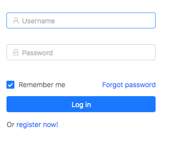
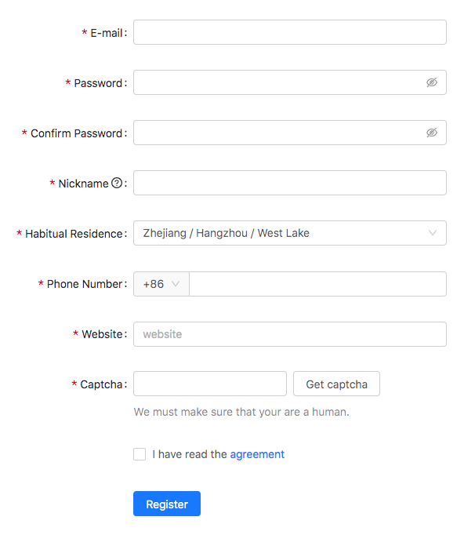
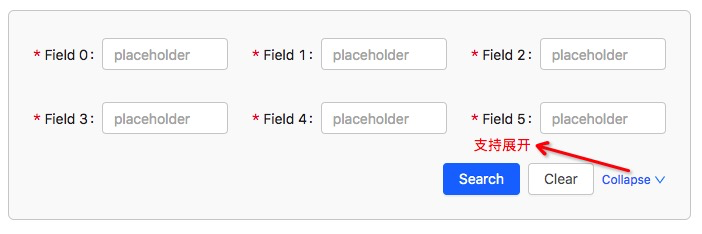

## UI 组件库 - Ant Design 的常见用法
> antd 是基于 Ant Design 设计体系的 React UI 组件库，主要用于研发企业级中后台产品。

#### 按需加载
&emsp;&emsp;有两种方法，具体可以参照[官方手册][1]：  
&emsp;&emsp;&emsp;&emsp;1、手动引入  
&emsp;&emsp;&emsp;&emsp;2、使用 babel-plugin-import 插件  

### 表单组件 Form
> 具有数据收集、校验和提交功能的表单，包含复选框、单选框、输入框、下拉选择框等元素。

#### 应用场景
&emsp;&emsp;通常来说，一般我们有以下三个应用场景。

##### 登录框
&emsp;&emsp;普通的登录框，可以容纳更多的元素。  

##### 注册框
&emsp;&emsp;用户填写必须的信息，用以注册新用户或者编辑。

##### 高级搜索框
&emsp;&emsp;三列栅格式的表单排列方式，常用于数据表格的高级搜索。  
&emsp;&emsp;有部分定制的样式代码，由于输入标签长度不确定，需要根据具体情况自行调整。

#### 使用
&emsp;&emsp;1、需要使用 **Form.create()** 反方的返回值 装饰自定义组件，包装过的组件会自带 this.props.form 属性。  
&emsp;&emsp;2、给 Form.Item 设置 **layout(整体)**、**labelCol(左侧表单名称)**、**wrapperCol(右侧表单控件)** 来控制表单的布局。   
&emsp;&emsp;3、通过 this.props.form 的 **getFieldDecorator** 方法，用于字段名称与表单项的绑定，同时可以设置表单的一些默认行为。  
&emsp;&emsp;&emsp;&emsp;默认行为有： 初始值、校验规则等。  
&emsp;&emsp;4、使用 this.props.form 的 **validateFieldsAndScroll** 方法，校验并获取一组输入域的值与 Error，参数格式为 **([fieldNames: string[]], options: object], callback(errors, values)) => void**，若 fieldNames 参数为空，则校验全部组件。  

 2019年11月26日 

[1]:https://ant.design/docs/react/introduce-cn
