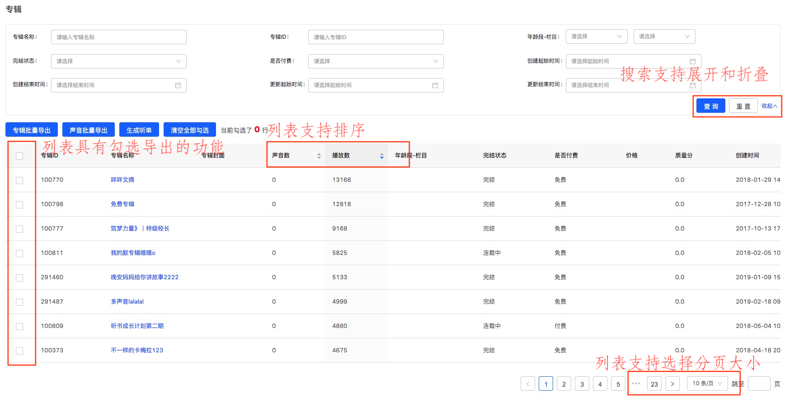

## 带有搜索框的 table 列表页面


&emsp;&emsp;在开发管理后台时，我们经常会碰见这样的页面，通过页面顶部的搜索，得到一组数据展示在表格中。下面来说一说实现的原理。   
&emsp;&emsp;1、将搜索框中的搜索条件都存储在页面级组件的 state 中；  
&emsp;&emsp;2、在页面级组件的 componentDidMount 中根据搜索条件请求接口获取默认数据；  
&emsp;&emsp;3、将请求到的数据也存入页面级组件的 state 中；   
&emsp;&emsp;4、将展示数据的 table 抽成一个单独的、只负责数据展示的组件，勾选、排序、切换分页等功能通过传入父组件的 callback 来实现；  

### 搜索框
&emsp;&emsp;实现可以参照 [Form 表单的使用](work/antd_form)    
&emsp;&emsp;这里讨论一点，那就是要不要将 **搜索模块** 抽成单独的组件？  
&emsp;&emsp;个人的答案是可以抽，甚至可以抽成一个全局的通用搜索模块，根据传入的一些参数，可以得到不同的搜索模块。
```javascript
// 使用全局通用搜索模块组件，传入参数即可
<SearchForm
  showColum={2} // 展示的行数
  items={[
    { type: 'input', key: 'title', lable: '名称', placeholder: '请输入名称' options },
    { type: 'select', key: 'type', lable: '类型', options }
  ]} // 搜索字段
  search={this.search} // 搜索按钮
  cancel={this.cancel} // 取消按钮
/>

// SearchForm 定义如下
import React, { Component } from 'react'
import { Form, Row, Col, Input, Button } from 'antd'

class SearchForm extends Component {
  constructor(props){
    super(props)

    this.state = {
      expand: false,
      expandName: '展开'
    }

    this.getItem = this.getItem.bind(this)
    this.toggle = this.toggle.bind(this)
  }

  // 搜索区域的展开收起
  toggle = (expand) => {
    expand = !expand
    const expandName = !expand ? '展开' : '收起'
    this.setState({
      expand,
      expandName
    })
  }

  getItem(item, index){
    const { showColum, form: { getFieldDecorator } } = this.props

    if(item.type === 'input'){
      return <Col>{
        getFieldDecorator(item.key, options)(<Input />)
      }</Col>
    }

    if(item.type === 'select'){
      return <Col span={11} key={item.key} style={{ display: (showColum*3-index) > 1 ? 'block' : 'none' }}>{
        getFieldDecorator(item.key, options)(<Select>
          <Option value={1}>{"有声书"}</Option>
          <Option value={2}>{"资讯"}</Option>
        </Select>)
      }</Col>
    }
    // ... 不断的扩展搜索组件支持的表单类型即可

  }

  // 查询按钮
  submit(){
    const { search, form: { validateFields } } = this.props
    validateFields((err, values) => {
      // 调用父组件的回调函数，修改搜索条件，刷新列表
      search(values)
    })
  }

  render(){
    const { expand, expandName } = this.state
    const { showColum, items, cancel } = this.props

    return <Form>
      <Row>{ items.map( (item, index) => getItem(item, index)) }</Row>
      <Row>
        <Button type="primary" onClick={this.submit}>查询</Button>
        <Button onClick={this.cancel}>重置</Button>
        <a onClick={() => this.toggle(expand)}>{expandName}<Icon type={? 'up' : 'down'} /></a>
      </Row>
    </Form>
  }
}

export default Form.create()(SearchForm)
```


### table 展示组件
大体上，一个 table 的展示组件有以下功能：  
&emsp;&emsp;1、根据数据展示每一列的内容；  
&emsp;&emsp;2、带有底部分页功能，上/下一页，跳页，选择分页大小；  
&emsp;&emsp;3、某一项带有排序功能；  
&emsp;&emsp;4、带有勾选导出功能；  

注意，实现这些功能的 callback 都是父组件通过 props 传递给子组件，子组件只负责数据的展示。  

```javascript
import React, { Component } from 'react'
import { PropTypes } from 'prop-types'

export default class ListTable extends Component {
  static propTypes = {
    orderBy: PropTypes.string, // 按照哪一列排序
    desc: PropTypes.bool, // true-降序 false-升序
    clickSort: PropTypes.func, // 点击排序项(更新父组件中的排序状态(切换排序列，同一列切换升序降序)，更新数据列表)
    showTotal: PropTypes.func, // 用于显示数据总量和当前数据顺序
    tableData: PropTypes.array, // 真实数据
    pageOrPageSizeChange: PropTypes.func, // 列表页面翻页或者每页尺寸改变 (更新父组件中的当前页后，刷新整个列表)
    total: PropTypes.number, // 数据总数
    current: PropTypes.number, // 当前页数
    pageSize: PropTypes.number, // 每页条数
    tableSelect: PropTypes.func, // 勾选时触发的 callback (将结果更新到父组件中 selectedRowKeys )
    selectedRowKeys: PropTypes.array, // 已勾选的结果
  }

  render() {
    const { 
      orderBy, 
      desc, 
      clickSort, 
      showTotal, 
      tableData, 
      pageOrPageSizeChange, 
      total, 
      current, 
      pageSize, 
      tableSelect, 
      selectedRowKeys 
    } = this.props

    const rowSelection = {
      selectedRowKeys,
      onChange: tableSelect
    }

    let firstColumns = [
      {
        title: '专辑ID',
        dataIndex: 'id',
        key: 'id',
        render: (text, record) => {
          return (
            <span>{text}</span>
          )
        },
      },
      {
        title: '专辑名称',
        dataIndex: 'title',
        key: 'title',
        render: (text, record) => {
          return (
            <Link to={`/!F1-parent-child/!S2-album/!F4-albumDetail/${record.id}`}>{text}</Link>
          )
        },
      },
      {
        title: '声音数',
        dataIndex: 'trackCount',
        key: 'trackCount',
        // 排序函数，本地排序使用一个函数，需要服务端排序可设为 true
        sorter: true,
        // 排序的受控属性，外界可用此控制列的排序，可设置为 'ascend' 'descend' false
        // ascend - 上升，descend - 下降
        sortOrder: orderBy !== 'track_count' ? false : desc ? 'descend' : 'ascend',
        render: (text, record) => {
          return <span>{text}</span>
        },
        onHeaderCell: column => { // 设置头部单元格属性
          return {
            onClick: () => {
              if (orderBy === 'track_count') {
                clickSort('track_count', !desc)
              } else {
                clickSort('track_count', true)
              }
            }
          }
        }
      }
    ]
    
    return (
      <div>
        <Table 
          columns={columns} 
          rowSelection={rowSelection}
          dataSource={tableData} 
          pagination={false} 
          scroll={{ x: 2000 }} 
        />
        <div style={{ textAlign: 'right', marginTop: 30 }}>
          <Pagination
            showSizeChanger
            showQuickJumper
            current={current}
            pageSize={pageSize}
            defaultCurrent={1}
            onShowSizeChange={pageOrPageSizeChange}
            onChange={pageOrPageSizeChange}
            total={total || 1}
            showTotal={showTotal}
          />
        </div>
      </div>
    )
  }
}
```

